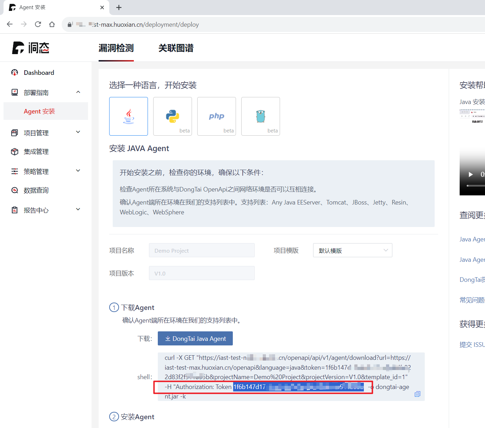

### For one-click start of various range containers


openrasp 8080/vulns/   https://github.com/baidu/openrasp.git
```cmd
docker run -it --rm -e IASTIP="http://IP" -e TOKEN="TOKEN" -e ProjectName="openrasp" registry.cn-hangzhou.aliyuncs.com/tscuite/bachang:openrasp-v20
```

webgoat 8087/WebGoat/   https://github.com/WebGoat/WebGoat.git
```cmd
docker run -it --rm -e IASTIP="http://IP" -e TOKEN="TOKEN" -e ProjectName="webgoat" registry.cn-hangzhou.aliyuncs.com/tscuite/bachang:webgoat-v20
```

benchmark 8443/benchmark/   https://github.com/OWASP-Benchmark/BenchmarkJava.git
```cmd
docker run -it --rm -e IASTIP="http://IP" -e TOKEN="TOKEN" -e ProjectName="benchmark" registry.cn-hangzhou.aliyuncs.com/tscuite/bachang:benchmark-v20
```

iast-jar 8085/iast6\?name=hello  https://github.com/spring-projects/spring-boot.git
```cmd
docker run -it --rm -e IASTIP="http://IP" -e TOKEN="TOKEN" -e ProjectName="iast-jar" registry.cn-hangzhou.aliyuncs.com/tscuite/bachang:iast-jar-v11
```

iast-grpc-java 8888 8083/grpc/send?text=1  https://github.com/HXSecurity/dongtai-grpc-range.git
```cmd
docker run -it --rm -e IASTIP="http://IP" -e TOKEN="TOKEN" -e ProjectName="iast-grpc-java" registry.cn-hangzhou.aliyuncs.com/tscuite/bachang:iast-grpc-java-v11
```


# Envs

## IASTIP

洞态的服务器的IP，比如：

```
-e IASTIP="https://xx-iast-xxx.huoxian.cn/"
```

## TOKEN

连接到服务器的Token，可以从“add agent”页面获取：



比如：

```
-e TOKEN="1f6b147d179xxxxxx83f2f911b55b"
```


## ProjectName

指定项目的名称，比如：

```
-e ProjectName="cc-iast-grpc-java"
```

建议在项目名称加上自己的名字作为前缀以便与其他人区分，因为环境Server环境可能很多人一起用的。

## OPTIONS

jvm选项，java启动应用的时候会拼接为jvm参数，比如：

```
docker run -it --rm -e IASTIP="http://IP" -e TOKEN="TOKEN" -e ProjectName="webgoat" -e OPTIONS='--add-opens="java.xml/com.sun.org.apache.xerces.internal.impl=ALL-UNNAMED"' registry.cn-hangzhou.aliyuncs.com/tscuite/bachang:webgoat-v20
```


